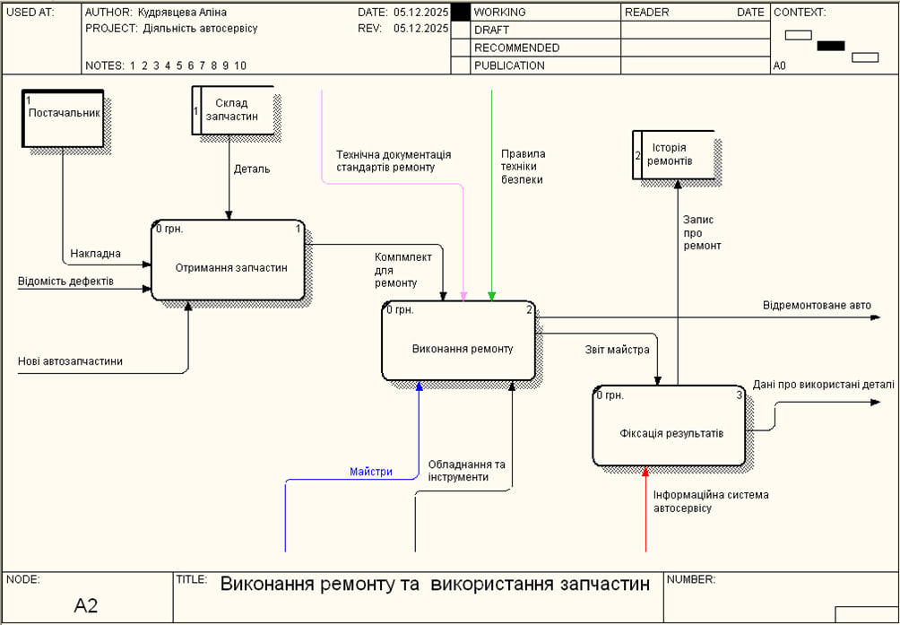

# Лабораторна робота №4
**Тема:** «CASE-засоби моделювання бізнес-процесів ІС, методологія IDEF3 та DFD»

**Виконала:** студентка 2 курсу групи [КС-23], [Кудрявцева А. В.]

---

### Мета роботи
Набути практичного досвіду створення моделей бізнес-процесів у нотаціях IDEF3 (Workflow Diagramming) та DFD (Data Flow Diagramming) за допомогою CASE-засобів BPWin.

### Хід роботи

#### 1. Декомпозиція процесу у нотації IDEF3
Для деталізації блоку **«Прийом замовлення та діагностика»** було взято за основу діаграму декомпозиції головного процесу (рівень А0), розроблену в попередній роботі.

*Рисунок 1. Декомпозиція головного процесу (рівень А0)*

Далі для деталізації першого блоку використано методологію **IDEF3**. Ця нотація дозволяє описати сценарій технологічного процесу та часову залежність подій.

**Опис діаграми IDEF3:**
1.  Процес ініціюється роботою «Огляд автомобіля та скарг».
2.  Далі використовується перехрестя розгалуження (Fan-out) типу **Synchronous AND (&)**, що запускає три паралельні процеси:
    * Визначення необхідних робіт.
    * Перевірка зайнятості майстрів.
    * Перевірка наявності запчастин.
3.  Зазначені процеси звертаються до об'єкта посилання (Referent) **«БД Автосервісу»** для отримання актуальної інформації.
4.  Формування фінального документа відбувається лише після завершення всіх гілок перевірки (через перехрестя злиття).

*Рисунок 2. Діаграма декомпозиції процесу «Прийом замовлення» у нотації IDEF3*

#### 2. Декомпозиція процесу у нотації DFD
Для деталізації другого блоку — **«Виконання ремонту та використання запчастин»** (див. Рис. 1) — було побудовано діаграму потоків даних (DFD). Ця модель фокусується на русі інформації та матеріальних ресурсів.

**Опис діаграми DFD:**
На діаграмі визначено:
* **Зовнішня сутність:** «Постачальник» (джерело вхідних ресурсів).
* **Сховища даних:** «Склад запчастин» (забезпечує облік деталей) та «Історія ремонтів» (архівує дані).
* **Процеси:** «Отримання запчастин», «Виконання ремонту» та «Фіксація результатів».

*Рисунок 3. Діаграма потоків даних (DFD) процесу виконання ремонту*

#### 3. Аналітичний опис моделі
*Виконано з використанням інструментів штучного інтелекту.*

**Критичний аналіз реалізації:**
1.  **Логічна узгодженість (IDEF3):** Використання синхронних перехресть (AND) у сценарії прийому замовлення є обґрунтованим. Це запобігає ситуаціям, коли замовлення приймається в роботу без наявних запчастин або вільного персоналу, мінімізуючи ризики простою.
2.  **Управління даними (DFD):** Введення двох окремих сховищ даних («Склад» та «Історія») дозволяє розділити оперативний облік матеріалів та архівну звітність, що відповідає принципам нормалізації даних.
3.  **Ресурсне забезпечення:** Модель враховує обмеження ресурсів (запчастини, час майстрів), що відображено через механізми зворотного зв'язку з базою даних.

---

### Висновки
У ході лабораторної роботи було успішно застосовано методології IDEF3 та DFD для моделювання бізнес-процесів автосервісу.
* **Діаграма IDEF3** дозволила формалізувати алгоритм прийняття рішення при оформленні замовлення, врахувавши паралельність процесів перевірки ресурсів.
* **Діаграма DFD** візуалізувала рух даних та матеріалів, чітко визначивши джерела інформації (зовнішні сутності) та місця її зберігання (сховища).

Поєднання цих нотацій з базовою моделлю IDEF0 дозволило створити комплексну архітектуру інформаційної системи.
