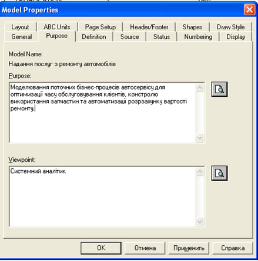
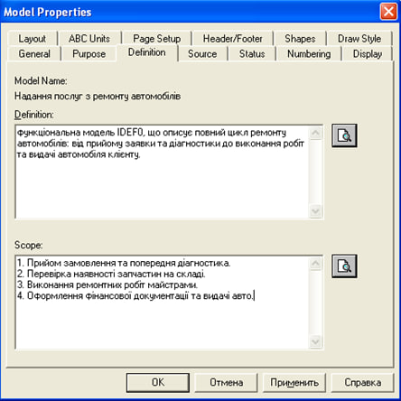
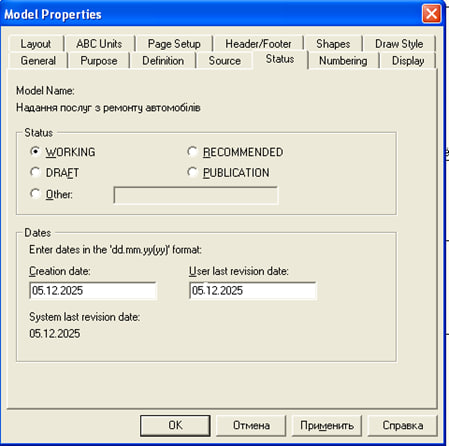
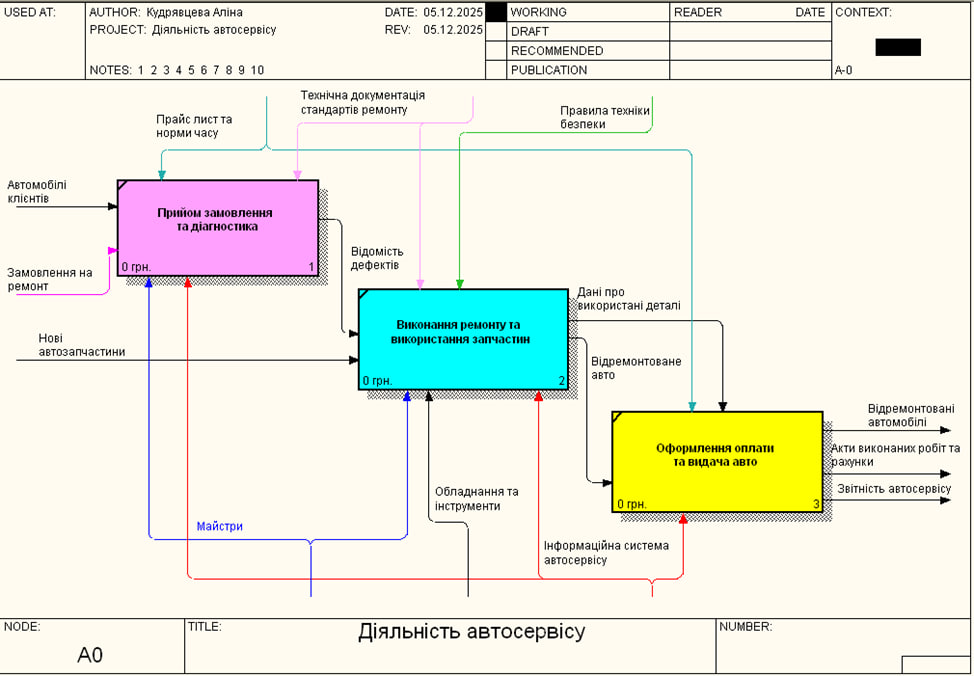
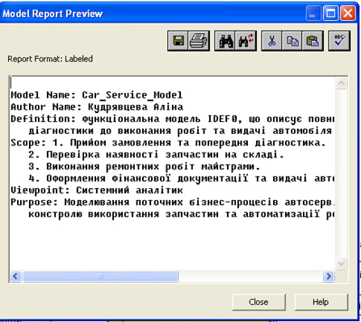
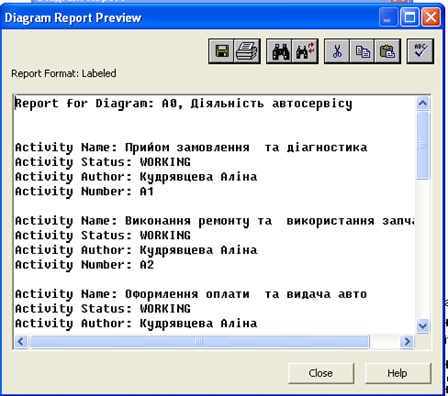
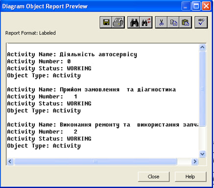
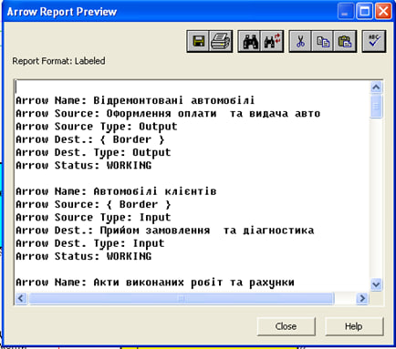
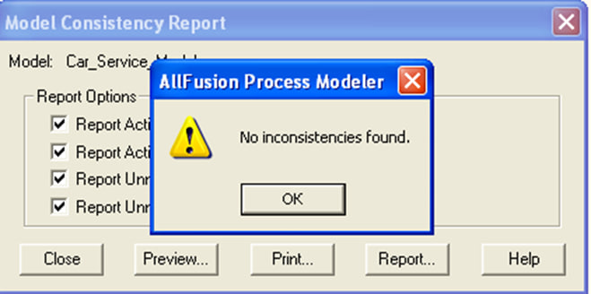

# Лабораторна робота №3
**Тема:** «CASE-засоби моделювання бізнес-процесів ІС, методологія IDEF0»

**Виконала:** студентка 2 курсу групи [КС-23], [Кудрявцева А.В.]

---

### Мета роботи
Набути досвіду створення IDEF0-моделі бізнес-процесів за допомогою CASE-засобів BPWin.

### Хід роботи

#### 1. Налаштування середовища
У середовищі BPWin було створено нову модель та налаштовано її властивості (Model Properties). Визначено мету моделювання, точку зору та часові рамки (AS-IS).

#### 2. Побудова контекстної діаграми (А-0)
Розроблено діаграму найвищого рівня для системи «Автосервіс». Визначено вхідні дані (замовлення, авто), вихідні результати (відремонтовані авто, документи), механізми (майстри, обладнання) та управління (правила, стандарти).

#### 3. Декомпозиція діаграми
Виконано декомпозицію головного процесу на три підпроцеси:
1. Прийом замовлення та діагностика.
2. Виконання ремонту та використання запчастин.
3. Оформлення оплати та видача авто.

#### 4. Побудова дерева вузлів (Node Tree)
Згенеровано ієрархічну структуру моделі, яка відображає вкладеність процесів.

#### 5. Генерація звітів
Сформовано звіти Model Report, Diagram Report, Arrow Report. Перевірка моделі показала відсутність помилок («No inconsistencies found»).

**Model Report (Загальний опис моделі):**

**Diagram Report (Звіт по діаграмах):**

**Diagram Object Report (Звіт по функціональних блоках):**

**Arrow Report (Звіт по зв'язках/стрілках):**

**Model Consistency Report (Перевірка на помилки):**
Перевірка моделі показала відсутність помилок («No inconsistencies found»).

---

### Висновки
Під час виконання роботи я опанувала методологію IDEF0, навчилася будувати контекстні діаграми та проводити їх декомпозицію у BPWin. Було успішно змодельовано бізнес-процес автосервісу та підтверджено його цілісність.
