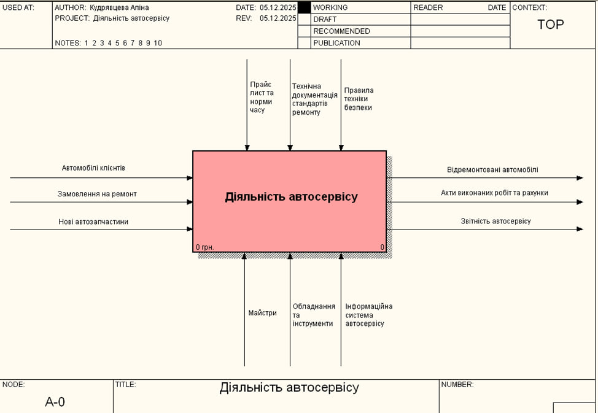
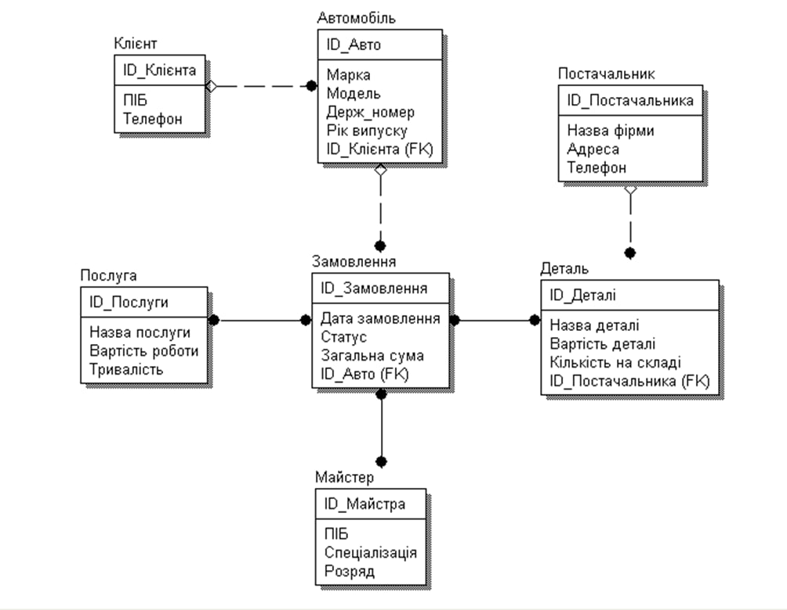
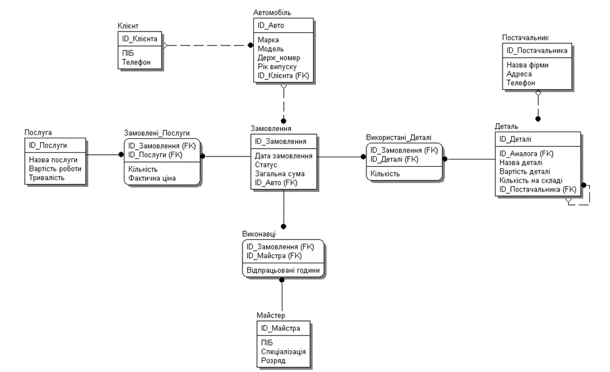
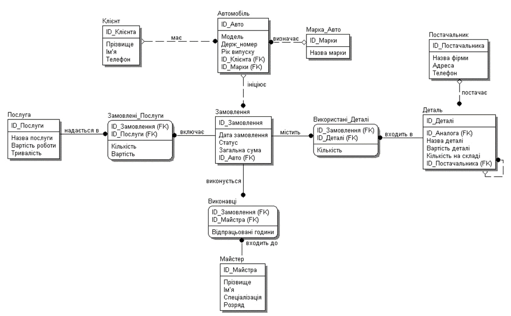

# Лабораторна робота №5
**Тема:** «CASE-засоби моделювання логічних та фізичних моделей (ERWin)»

**Виконала:** студентка 2 курсу групи [КС-23], [Кудрявцева Аліна Володимиівна]

---

### Мета роботи
Навчитися працювати з CASE-засобом CA ERWin Data Modeler для проектування та документування баз даних, створення логічних та фізичних моделей, нормалізації та генерації SQL-скриптів.

### Постановка задачі (Варіант 14: Автосервіс)
Спроектувати БД для автосервісу. Система має враховувати прийом замовлень, наявність запчастин, роботу майстрів (без накладок у розкладі) та формування звітності.

---

### 1. Функціональне моделювання (IDEF0, IDEF3, DFD)
*(На основі матеріалів попередніх робіт)*

#### Контекстна діаграма та декомпозиція (IDEF0)
Відображає межі системи та деталізацію на основні підпроцеси: прийом замовлення, ремонт, оплата.

*Рисунок 1. Контекстна діаграма*

*Рисунок 2. Декомпозиція головного процесу*

#### Моделювання сценаріїв (IDEF3)
Діаграма описує послідовність дій при прийомі замовлення, включаючи логіку розгалуження для паралельної перевірки ресурсів.

*Рисунок 3. Діаграма IDEF3*

#### Моделювання потоків даних (DFD)
Візуалізує рух інформації про запчастини та історію ремонтів між процесами та сховищами даних.

*Рисунок 4. Діаграма DFD*

---

### 2. Проектування бази даних (Ітерації ERWin)

**Ітерації 1-3: Сутності та зв'язки**
Виділено основні сутності (`Клієнт`, `Авто`, `Замовлення`, `Майстер` тощо), визначено первинні ключі та встановлено базові зв'язки (1:N та M:N).

**Ітерація 4: Усунення зв'язків M:N**
Для приведення моделі до 1NF зв'язки "багато-до-багатьох" перетворено на асоціативні сутності:
* `Замовлені_Послуги` (додано атрибути: Кількість, Фактична ціна).
* `Використані_Деталі` (додано атрибут: Кількість).
* `Виконавці` (додано атрибут: Відпрацьовані години).

**Ітерація 5: Рекурсивні зв'язки**
До сутності `Деталь` додано рекурсивний зв'язок для відображення деталей-аналогів (`ID_Аналога`).

---

### 3. Нормалізація моделі

**Ітерація 6: Приведення до 1NF**
Модель відповідає першій нормальній формі, оскільки:
1.  Всі атрибути є атомарними (неподільними).
2.  Відсутні повторювані групи (списки винесено в окремі таблиці).
3.  Кожна сутність має унікальний первинний ключ.

**Ітерація 7: Приведення до 2NF**
Проведено аналіз сутностей зі складеним ключем (`Замовлені_Послуги`, `Використані_Деталі`). Встановлено, що всі неключові атрибути (наприклад, `Кількість`) залежать від *повного* ключа, а не від його частини. Часткові залежності відсутні. Це дозволяє уникнути аномалій вставки, оновлення та видалення.

**Ітерація 8: Приведення до 3NF (Фінальна логічна модель)**
Усунуто транзитивну залежність у сутності `Автомобіль` (атрибут "Марка" залежав від бренду). Створено довідник `Марка_Авто`. Додано дієслівні назви зв'язків.

**Ітерації 9-10: Вищі нормальні форми (4NF, 5NF)**
* **4NF:** У моделі відсутні незалежні багатозначні залежності всередині однієї сутності.
* **5NF:** Відсутні складні залежності з'єднання, які вимагали б декомпозиції на 3+ таблиці для відновлення інформації.
Модель є повністю нормалізованою.

---

### 4. Фізична модель та SQL

**Фізична модель даних**
Згенеровано фізичну структуру з визначеними типами даних (`INTEGER`, `VARCHAR`, `DATETIME`).

**SQL-скрипт**
За допомогою Forward Engineering згенеровано код для створення БД (CREATE TABLE, ALTER TABLE).

---

### Висновки
У ході роботи спроектовано нормалізовану базу даних для автосервісу, пройдені етапи від концептуального моделювання до генерації фізичного SQL-коду.
